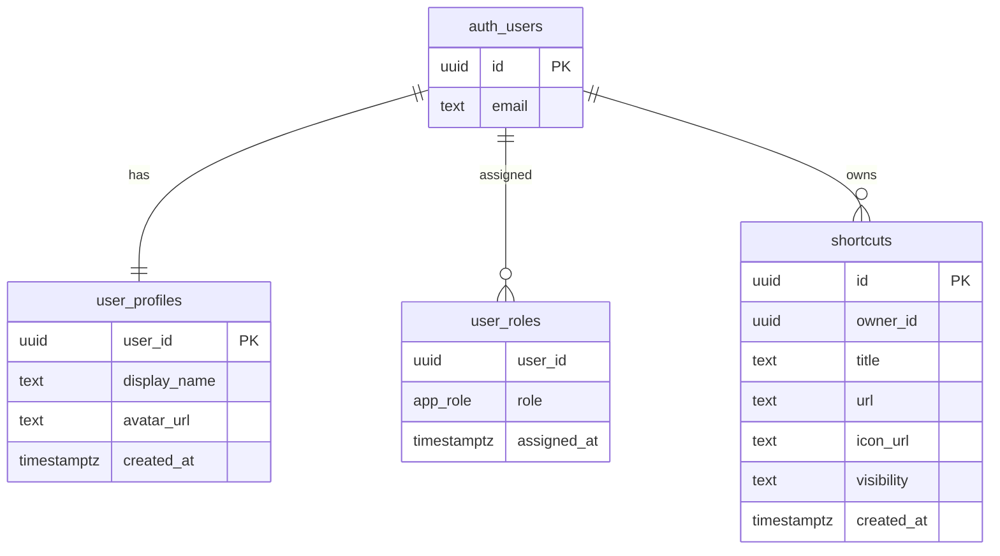

# App Dashboard

A multi-page web app that provides a personal shortcuts dashboard. Users register and manage their own shortcuts (local network or public URLs). Admins manage users and can remove inappropriate shortcuts. Authentication, database, and file storage are powered by Supabase.

## Features

- User registration, login, logout (Supabase Auth)
- Personal dashboard with shortcut CRUD
- Admin panel for user and shortcut moderation
- Role-based access (admin/user) with RLS policies
- Supabase Storage support for user files (icons, images)
- Vite-powered build and Bootstrap UI

## Architecture

- Frontend: HTML, CSS, JavaScript, Vite, Bootstrap 5
- Backend: Supabase (Postgres database, Auth, Storage, Edge Functions)
- Auth: Supabase Auth with role checks via `user_roles`
- Hosting: Netlify (see `netlify.toml`)

## Database Schema (High Level)



Notes:
- `app_role` is an enum with values `user` and `admin`.
- RLS policies restrict edit access to owners and admins.

## Local Development Setup

### Prerequisites

- Node.js 16+ and npm
- Supabase project (URL + Anon Key)

### Install

1. Clone the repository:
```bash
git clone <repository-url>
cd App-Dashboard
```

2. Install dependencies:
```bash
npm install
```

3. Create local env file and set Supabase keys:
```bash
cp .env.example .env.local
```

```
VITE_SUPABASE_URL=your_supabase_project_url
VITE_SUPABASE_ANON_KEY=your_supabase_anon_key
```

4. Start the dev server:
```bash
npm run dev
```

Open `http://localhost:5173`.

### Demo Accounts (No Hardcoded Credentials)

- Register a user via the UI.
- Promote a user to admin using the provided SQL scripts in `supabase/scripts/`.

## Key Folders and Files

```
src/
   js/
      main.js                    # App bootstrap
      router.js                  # Page routing
      components/                # Shared UI components
      pages/admin/               # Admin page logic
      services/supabase.js       # Supabase client
   pages/
      home/                      # Home screen
      login/                     # Login screen
      register/                  # Registration screen
      dashboard/                 # User dashboard
      settings/                  # Profile/settings
      admin/                     # Admin panel UI
   styles/main.css              # Global styles

supabase/
   migrations/                  # DB migrations (RLS, roles, policies)
   functions/                   # Edge Functions (demo user helpers)
   scripts/                     # Admin setup SQL scripts

index.html                     # Vite entry
netlify.toml                   # Netlify build config
vite.config.js                 # Vite config
```

## Pages and Routes

- `/` - Home
- `/login` - Login
- `/register` - Register
- `/dashboard` - User dashboard
- `/settings` - User settings
- `/admin` - Admin panel

## Deployment (Netlify)

1. Build command: `npm run build`
2. Publish directory: `dist`
3. Set env vars in Netlify:
    - `VITE_SUPABASE_URL`
    - `VITE_SUPABASE_ANON_KEY`

## Contributing

This project is part of SoftUni AI curriculum.

## License

MIT
